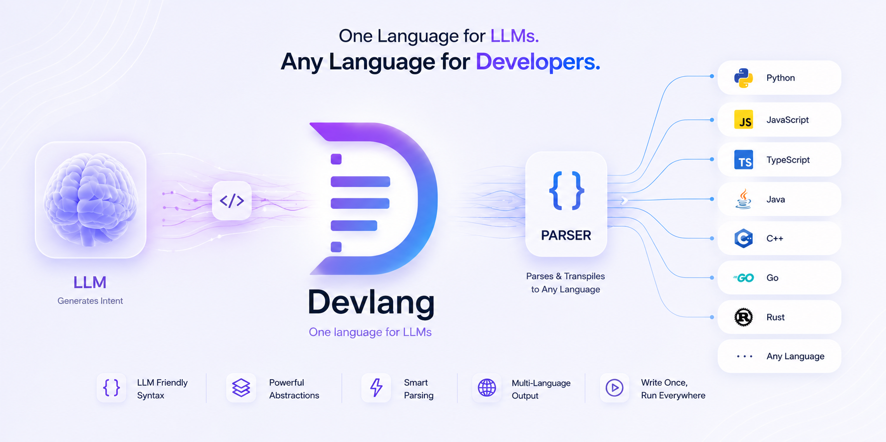

# Devlix

**An AI app builder where the model writes a tiny language — not code — and a
deterministic compiler turns it into a real, runnable product for _zero_ model
tokens.**

Ask Devlix for an app or a backend. Instead of having an LLM write thousands of
lines of React Native or Express (slow, expensive, and a fresh chance to
hallucinate a broken import on every line), the model writes **DevLang**: a small,
indentation-based language over a closed, professional vocabulary. A pure,
deterministic compiler does the rest — emitting real code that is **correct by
construction**, gated by the actual toolchain's parser so it can never ship
something that doesn't build.

> **One language for the model. Real stacks underneath.**

---

## The idea in one minute

When a model writes code directly, ~90% of every file is boilerplate it must
retype every time: imports, hooks, `StyleSheet`, navigation handlers, middleware,
Prisma wiring, auth flows. That boilerplate is the compiler's job — not the
model's.

So Devlix splits the problem:

- **The model writes _intent_** — 10–20 lines of DevLang per screen, ~150 lines
  for a whole backend.
- **A deterministic compiler owns the _implementation_** — real component/library
  APIs, theme tokens, wired navigation, working state, capability integrations,
  navigation shells, splash, packaging; and for backends: a Prisma schema, an
  Express app, CRUD routers, auth, sockets, jobs, Docker.
- **A real gate proves correctness** — every emitted file is parsed by the actual
  toolchain (`@babel/parser`). Invalid output is a hard compiler error, never
  something that reaches the user.

The same DevLang spec renders three ways on the frontend — an in-app design
preview, a shared web preview, and the compiled Expo code — so what a designer
approves is exactly what ships.

---

## One config picks the stack

Every project declares its **kind** and **target** in `devlang.json`; a single
entry point reads it and dispatches. The kind fixes the _structure_; the target
fixes the _language/framework_.

| kind | what it is | structure | target today | on the roadmap |
|---|---|---|---|---|
| `app` | a mobile app | screens (`app.devlang` + `*.devlang`) | **Expo / React Native** | — |
| `api` | a backend | a service (`service.devlang`) | **Node.js / Express / Prisma** | python, go, rust |
| `web` | a website | pages | — | next, react |

Because the dispatcher reads the config, adding `target: "python"` / `"go"` /
`"next"` later never changes a single caller.

---

## The token math (measured)

The whole point is fewer **output tokens** — the expensive, error-prone half of a
generation. These are **precise counts** (GPT-4o `o200k_base` tokenizer) of what
the model writes in DevLang vs. the code the compiler emits for it. Framework
scaffolding the model would never re-author is excluded on both sides; every
project below compiles green through the real parser gate.

### Mobile apps → Expo / React Native

| App | Screens | DevLang tok | Expo tok | Ratio | Saved |
|---|--:|--:|--:|--:|--:|
| telegram-messenger | 4 | 2,768 | 7,803 | **2.8×** | 65% |
| shopnest-ecommerce | 8 | 8,450 | 24,183 | **2.9×** | 65% |
| instagram-ui | 7 | 3,743 | 11,240 | **3.0×** | 67% |
| swap-social (smfn-like) | 10 | 3,158 | 16,663 | **5.3×** | 81% |

### Backends → Node.js / Express / Prisma

| Service | DevLang tok | Node tok | Ratio | Saved | Files |
|---|--:|--:|--:|--:|--:|
| blog-api | 95 | 935 | **9.8×** | 90% | 15 |
| ai-service | 310 | 5,574 | **18.0×** | 94% | 30 |
| chat-api | 141 | 3,979 | **28.2×** | 96% | 24 |
| shop-api | 167 | 4,829 | **28.9×** | 97% | 22 |
| super-api | 196 | 6,422 | **32.8×** | 97% | 29 |
| tasks-api | 130 | 4,908 | **37.8×** | 97% | 23 |

Apps compress ~3–5×; backends compress **~10–38×** (a tiny service description
becomes a whole project). A **full product** — the `swap-social` app + the
`super-api` backend — is **3,354 DevLang tokens → 23,085 generated tokens (6.9×)**.

---

## What you can build

### Apps (Expo)

A closed **47-component** vocabulary: layout (Stack/Row/Grid/Scroll), content
(Text/Image/Card/ListRow/Avatar/Badge/…), data blocks (List/Deck/Pager/Carousel/
Gallery/**StoryBar**), controls (Input/Toggle/Checkbox/Radio/SegmentedControl/
Slider/Stepper/Rating), overlays (**Sidebar/Sheet/Dialog**), and media (Video/
Gradient/Blur/Map/QR). Plus:

- **Actions** — navigate, set/toggle state, toast (positioned), a native `alert`,
  and **`-> auth google|apple|github`** (config-driven login, keys in a config
  file, callable from any node). Reusable named actions (`fn`) for deduplication.
- **Three dialog styles** (native OS, bottom, custom), **the whole `@expo/vector-
  icons` universe** via `family:name`, an 11-entry motion catalogue, and
  **automatic keyboard handling** (keyboard-aware scroll, a composer pinned above
  the keyboard, chat auto-scroll).
- Theme + navigation (native/classic/floating/pill/drawer) + device capabilities
  in a one-line manifest.

### Backends (Node.js)

A `service.devlang` file → a runnable Express + Prisma backend, **auto-Dockerized**:

- **Data** — `model` with typed fields, relations and defaults; `api <Model>` →
  full REST CRUD with Prisma handlers, optionally behind JWT. Any DB via Prisma
  (Postgres / MySQL / SQLite / MongoDB / …).
- **Auth** — `auth password google apple github` → a real auth router (bcrypt
  register/login + JWT + OAuth callbacks), config-driven.
- **Real-time & work** — `socket` (Socket.IO), `websocket`, `job` (scheduled),
  `queue` (RabbitMQ). A backend need not be an API: `bot telegram` compiles to a
  polling worker.
- **npm-install-like services** — name a known service (`use openai anthropic
  openrouter stripe coingecko s3 sendgrid twilio`) and the compiler adds the
  dependency, the env var, and a ready client. **Drop a Swagger/Postman JSON in
  `apis/`** and a typed client for THAT API appears too.
- **More** — AES encryption, an auto-generated **OpenAPI** doc at `/docs`, a
  blockchain client (ethers EVM + Solana via `chain …`), an external HTTP client,
  typed env + port, and a `Dockerfile` + `docker-compose.yml`.

---

## The repositories

| Repo | What it is |
|---|---|
| **[Devlang](https://github.com/DevlixAi/Devlang)** | The language + the deterministic compiler, self-contained and independently verifiable (`npm run verify`). Screen dialect → Expo, service dialect → Node. Includes the VS Code extension, the golden templates, example kits, and the full [`REPORT.md`](https://github.com/DevlixAi/Devlang/blob/main/REPORT.md) + [`ROADMAP.md`](https://github.com/DevlixAi/Devlang/blob/main/ROADMAP.md). |
| **[Devlix-Api](https://github.com/DevlixAi/Devlix-Api)** | The Devlix backend service — the design cascade, the code compilers, and the build orchestration. |
| **[Devlix-app](https://github.com/DevlixAi/Devlix-app)** | The Devlix mobile client (Expo) — the live design canvas that renders a DevLang spec interactively (select / move / edit / prompt-patch) with zero server round-trips. |
| **[Devlang-Skill](https://github.com/DevlixAi/Devlang-Skill)** | The per-agent skills that teach an LLM to author and edit DevLang. |

---

## Why it's correct, not just cheap

- **Deterministic** — same DevLang in → same code out, byte for byte.
- **Gated** — every emitted file is checked by the real parser (`@babel/parser`
  today; each future target ships its own gate — `tsc`, `go vet`, `cargo check`,
  …). "The compiler only ever ships correct code" is enforced, not hoped.
- **Config, not secrets** — OAuth keys, API URLs and DB URLs live in config /
  `.env`, never in the tokens the model emits.
- **Extensible by design** — components, animations, capabilities, backend
  services and compile targets are all registries; growing the system never
  touches the core.

---

## Roadmap

Today: **Expo** (apps) and **Node.js** (backends). Next, the same discipline —
a closed vocabulary, a deterministic compiler, a real gate — extends to more
targets: React/Next (web), SwiftUI, Jetpack Compose and Flutter (native
frontends); Go, Rust, Python and Java (backends); and Docker / docker-compose /
Kubernetes / CI (delivery). See the
[full roadmap](https://github.com/DevlixAi/Devlang/blob/main/ROADMAP.md).

---

**Devlix** — [devlix.ai](https://devlix.ai)
